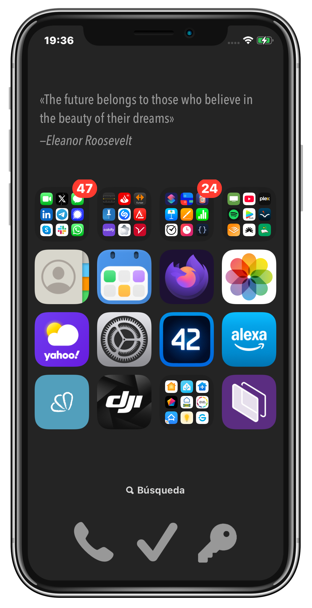

<!-- Title -->
<h1 align='center'> Bus arrivals widget for iOS </h1>

<!-- tag line -->
<h3 align='center'> For Valencia, Spain </h3>

<!-- tech stack badges ---------------------------------- -->

  
  

 

## Introduction
This creates an iOS widget, which displays a famous random quote every few minutes. It uses the free [Quotes-API](https://github.com/theriturajps/Quotes-API) to fetch the quotes.

## Requirements
- [Scriptable](https://scriptable.app) must be installed in your iOS device.

## Installation
1. Save the `quote.js` file to the `/Scriptable` folder inside your iCloud Drive folder.
2. You can now launch the `quote.js` script from the Scriptable app, to see it works.
3. Go to the home screen in which you want to create the widget.
4. Tap and hold in an empty area of the screen, until everything starts to wiggle.
5. Tap the Edit button at the top left of the screen and select Add widget.
6. Search for Scriptable and select it.
7. Tap the Add widget at the bottom.
8. Adjust its size to the medium size (it should span the entire width of the screen, but remaining as small as possible in height).
9. Tap inside the wiggling widget you just created.
10. Tap the Edit widget option.
11. Scroll down and select the quote script.
12. Choose 'Run Script' instead of 'Open App' in the `When interacting' field.
13. Tap outside to go back to your home screen.
14. In a few seconds you should see a random quote appear.

## Caveats
- The widget should load a new quote every few minutes (not less than 5), but it is not possible to refresh the data at a precise interval. Apple determines its refresh rate, which is normally every few minutes. 

## Tech stack
- Javascript
- [Scriptable](https://scriptable.app)

